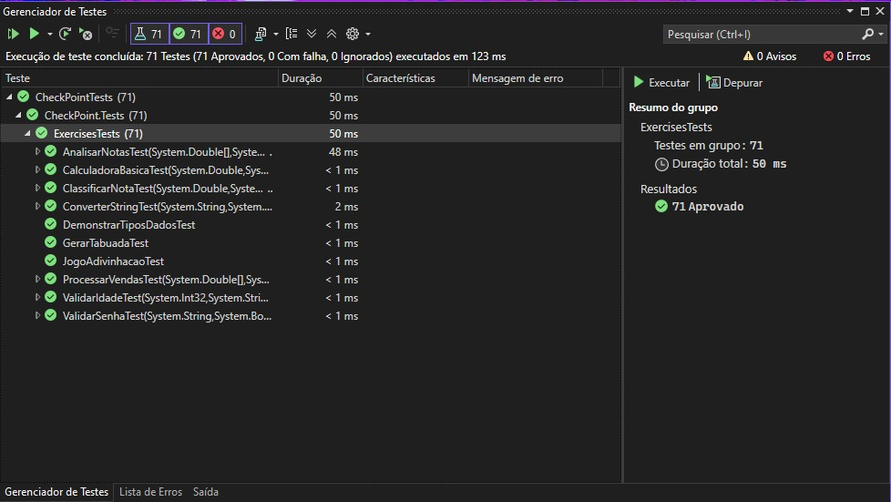

# CP1-CSharp

Victor Didoff - RM 552965

[x] - 2 Solutions (Tests and Project).

[x] - 10 / 10 Exercises executed and tested`s on both

## Tests
[file](./CheckPointTests/ExercisesTests.cs)




## Main Project 
[main-file](./CheckPoint/Program.cs)


[exercises-class](./CheckPoint/Exercises.cs)


## Console Output
```diff
=== CHECKPOINT 1 - FUNDAMENTOS C# - Turma  3ESPY ===

1. Testando DemonstrarTiposDados...
Int32 : 8
Double : 8,7
Boolean : False
Char : y
String : Lorem ipsum dolor sit amet

2. Testando CalculadoraBasica (SWITCH)...
15

3. Testando ValidarIdade (IF/ELSE)...
Adulto

4. Testando ConverterString...
int: 123

5. Testando ClassificarNota (SWITCH)...
Bom

6. Testando GerarTabuada (FOR)...
5 x 1 = 5
5 x 2 = 10
5 x 3 = 15
5 x 4 = 20
5 x 5 = 25
5 x 6 = 30
5 x 7 = 35
5 x 8 = 40
5 x 9 = 45
5 x 10 = 50

7. Testando JogoAdivinhacao (WHILE)...
Tentativa 1: muito baixo
Tentativa 2: muito alto
Tentativa 3: correto

8. Testando ValidarSenha (DO-WHILE)...
Senha válida

9. Testando AnalisarNotas (FOREACH)...
Média: 8,2
Aprovados: 4
Maior: 10,0
Menor: 6,5
B: 1, C: 1, A: 2, D: 1

10. Testando ProcessarVendas (FOREACH múltiplo)...
Categoria A: Vendas R$ 1200,00, Comissão R$ 120,00
Categoria B: Vendas R$ 700,00, Comissão R$ 49,00
Categoria C: Vendas R$ 800,00, Comissão R$ 40,00

=== RESUMO: TODAS AS ESTRUTURAS FORAM TESTADAS ===
? IF/ELSE: Testado na validação de idade
? SWITCH: Testado na calculadora e classificação de notas
? FOR: Testado na tabuada
? WHILE: Testado no jogo de adivinhação
? DO-WHILE: Testado na validação de senha
? FOREACH: Testado na análise de notas e processamento de vendas
```
